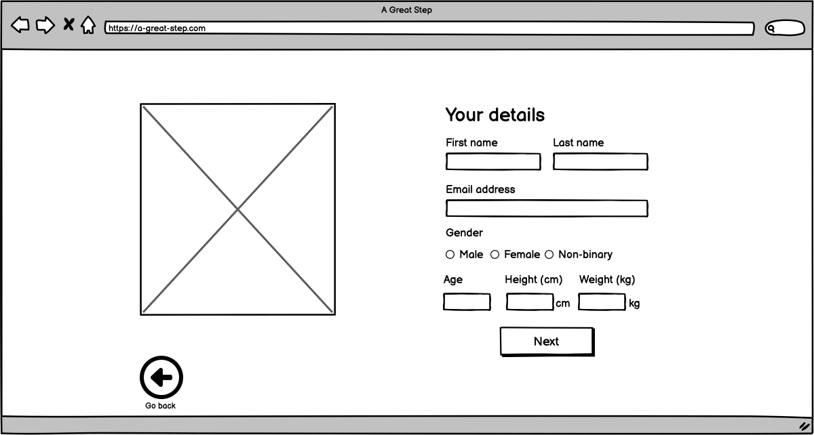

<h1 align="center">A Great Step - Step goal app</h1>

[Click here to view the live "A Great Step" web app.](https://stephendawsondev.github.io/A-Great-Step)

A Great Step is a web app that allows users to set a step goal with a particular target date in mind. The user inputs their current activity level, age, gender, weight height and target weight, and they input when they want to acheive that weight. The app generates a plan that can be exported as JSON and imported on other devices.

<div align="center"></div>

<details><summary style="font-size: 20px">User Experience (Click to expand)</summary>
<br>

### User stories

- #### First Time Visitor Goals

  1. As a first time visitor, I want to be able to create easily navigate the site.
  2. As a first time visitor, I want receive errors if I input invalid data.
  3. As a first time visitor, I want to be able to export my goal to use later.
  4. As a first time visitor, I want to understand the purpose of the app.

- #### Returning Visitor Goals

  1. As a returning visitor, I want to be able to import my goal from another device.
  2. As a returning visitor, I want to be able to edit my goal.

- #### Frequent User Goals
  1. As a frequent user, I want to be able to view my updated goal timeframe.
  2. As a frequent user, I want to be able to make updates to my goal.

<br>

### Design

- #### Colour Scheme
  - The main colours used are blue, white and turquiose. They were chosen to give a clean and professional look to the site. The colours are also bright to get a an energetic feeling.
- #### Typography
  - Lobster 2 was a fun and decorative choice made for the main heading. It is flowy, which goes with the theme of movement. The other fonts are less flashy so that they the app remains clean and accessible.
- #### Imagery
  - A number of SVG images are used from the [Storyset](https://storyset.com/) website. The people in the images range in age so that all age groups are encourage to participate. The people in the images also partake in different levels of activity, which is also to encourage those of all levels of activity to participate.
    <br>
    <br>

### Wireframes

<details><summary>Desktop landing (Click to expand)</summary>
    
</details>
<details><summary>Mobile landing (Click to expand)</summary>
    
</details>

<br>
<details><summary>Desktop import a goal (Click to expand)</summary>
    
</details>
<details><summary>Mobile import a goal (Click to expand)</summary>
    
</details>

<br>
<details><summary>Desktop personal details (Click to expand)</summary>
    
</details>
<details><summary>Mobile personal details (Click to expand)</summary>
    
</details>

<br>
<details><summary>Desktop activity level (Click to expand)</summary>
    
</details>
<details><summary>Mobile activity level (Click to expand)</summary>
    
</details>

<br>
<details><summary>Desktop goal details (Click to expand)</summary>
    
</details>
<details><summary>Mobile goal details (Click to expand)</summary>
    
</details>

<br>
<details><summary>Desktop goal plan (Click to expand)</summary>
    
</details>
<details><summary>Mobile goal plan (Click to expand)</summary>
    
</details>

<br>
<details><summary>Desktop 404 page (Click to expand)</summary>
    
</details>
<details><summary>Mobile 404 page (Click to expand)</summary>
    
</details>
<br>
</details>
<details><summary style="font-size: 20px">Features (Click to expand)</summary>
<br>

- Responsive on all device sizes
- Clean and user-friendly interface design
- Fast loading speed
- Accessible
- Ability to import/export JSON goals

<br>

### Site sections

<br>
<details><summary>Landing section initial section (Click to expand)</summary>
    <br>
    The landing section is the first thing the user sees. Straight away they can see that the app is fitness-related. They have the option to create a goal here, or import an existing goal.  
    <br>
    <br>
    
</details>
<br>
<details><summary>Landing section - Import a goal (Click to expand)</summary>
    <br>
    By clicking on the "Import goal" button on the landing page, the user is presented with a text input where they can add their previously export JSON goal data. 
    <br>
    <br>
    
</details>

<br>
<details><summary>Your details (Click to expand)</summary>
    <br>
    The next section on the homepage that the user can scroll to is the "Your details" section, where they can input their personal details such as name, email and weight.
    <br>
    <br>
    
</details>

<br>
<details><summary>Your activity level (Click to expand)</summary>
    <br>
    The activity level section is to gauge how active the user is, which is used in the calculation later. I made the decision to assign each level of activity to a value so that the user doesn't have to input a number. They just need to select the level of activity that best describes them.
    <br>
    <br>
    
</details>

<br>
<details><summary>Your goal (Click to expand)</summary>
    <br>
    The final section on the homepage gives the user the opportunity to input what weight they want to be, when they want to reach that weight and how many days a week they have available to exercise. This data is used in the final calculation too. When they click "Generate plan", it takes them to the walking plan page.
    <br>
    <br>
    
</details>

<br>
<details><summary>Walking plan (Click to expand)</summary>
    <br>
    The walking plan page is customised to the user and their goal. In this case, it gives me my name and tells me how many steps I need to walk each day to reach my goal. The date range is calculated from today's date to the user's target date.
    <br>
    <br>
    
</details>

<br>
<details><summary>Walking plan - Export goal (Click to expand)</summary>
    <br>
    By clicking the "Export goal" button, the user's JSON data is saved to their clipboard. With that, they can send it to themselves and then import it on another device. When the button is clicked, the user gets some feedback that the button has been clicked by displaying a small popup.
    <br>
    <br>
    
</details>
<br>
</details>
<details><summary style="font-size: 20px">Technologies used (Click to expand)</summary>
<br>

### Languages Used

- [HTML5](https://en.wikipedia.org/wiki/HTML5)
- [CSS3](https://en.wikipedia.org/wiki/Cascading_Style_Sheets)
- [JavaScript](https://en.wikipedia.org/wiki/JavaScript)

### Frameworks, Libraries & Programs Used

1. [Cooolors:](https://coolors.co/)
   - Cooolors was used to come up with the app's colour scheme.
2. [Font Joy](https://fontjoy.com/)
   - Font Joy was used to find the font pairing for the app.
3. [Google Fonts:](https://fonts.google.com/)
   - Google fonts were used to import the 'Catamaran', 'Exo' and 'Lobster 2' fonts into the style.css file which are used throughout the project.
4. [Git:](https://git-scm.com/)
   - Git was used for version control by utilising VSCode terminal to commit to Git and push to GitHub.
5. [GitHub:](https://github.com/)
   - GitHub is used to store the projects code after being pushed from Git.
6. [Balsamiq:](https://balsamiq.com/)
   - Balsamiq was used to create the [wireframes](assets/images/readme-images/wireframes) during the design process.
7. [SVG Repo:](https://www.svgrepo.com/)
   - SVG Repo was used to create the footprint images for the activity level section.
   <br>
   </details>
      <details><summary style="font-size: 20px">Testing (Click to expand)</summary>
   <br>

The W3C Markup Validator and W3C CSS Validator Services were used to validate every page of the project to ensure there were no syntax errors in the project.

[W3C Markup Validator:](https://validator.w3.org/)

<details><summary>Homepage (Click to expand)</summary>
    <br>
    
</details>
  
<br>

<details><summary>Walking Goal (Click to expand)</summary>
    <br>
    
</details>

<br>

<details><summary>404 page (Click to expand)</summary>
    <br>
    
</details>

<br>
<br>
[W3C CSS Validator](https://jigsaw.w3.org/css-validator/):

[CSS Homepage validation results](https://jigsaw.w3.org/css-validator/validator?uri=https%3A%2F%2Fstephendawsondev.github.io%2FA-Great-Step%2F&profile=css3svg&usermedium=all)

 <br>
 
 [JSHint](https://jshint.com/):
 <details><summary>JSHint Code Validation (Click to expand)</summary>
    <br>
    
</details>

<br>
<br>

### Testing Performance

I used the [Pagespeed Insights tool](https://pagespeed.web.dev/) to check my app's speed, best practices and accessibility. Here are the results:

#### Mobile:

<details><summary>Homepage (Click to expand)</summary>
  <br>
  
</details>

<details><summary>404 page (Click to expand)</summary>
  <br>
  
</details>

<details><summary>Walking Goal (Click to expand)</summary>
  <br>
  
</details>
<br>

#### Desktop:

<details><summary>Homepage (Click to expand)</summary>
    <br>
    
</details>
<details><summary>404 page (Click to expand)</summary>
    <br>
    
</details>
<details><summary>Walking Goal (Click to expand)</summary>
    <br>
    
</details>
<br>

### Testing User Stories from User Experience (UX) Section

<br>

#### **First Time Visitor Goals**

<br>

> As a first time visitor, I want to be able to create easily navigate the site.

On landing on the site, the user is presented with two large buttons, which allow them to either import a goal or create a new one. The limitation of choice means the user can easily decide what they want to do. They can also scroll down to see the other sections of the site. If they visit a page that doesn't exist, they have a button to redirect them back to the homepage.

> As a first time visitor, I want receive errors if I input invalid data.

If the user inputs invalid data and tries to progress to the next section, the inputs will be validated and the user is presented with a clear error explaining what they need to do.

> As a first time visitor, I want to be able to export my goal to use later.

On the Walking Goal page, the user only has to click the "Export goal" button to copy the JSON data to their clipboard. A popup appears to let them know that the data has been copied to the clipboard.

> As a first time visitor, I want to understand the purpose of the app.

The app's name is "A Great Step" and the pun already indicates that the app is related to walking. There is also a subtitle that helps to explain the purpose of the app. The images used on each section also help to convey the purpose of the app.

<br>

#### **Returning Visitor Goals**

<br>

> As a returning visitor, I want to be able to import my goal from another device.

On the homepage, when the user clicks "Import a goal", they are presented with a popup that instructs them to input the JSON data for an existing goal. When they click "Import", the data is validated and if it is valid, the user is redirected to the Walking Goal page.

> As a returning visitor, I want to be able to edit my goal.

When the user imports a goal, they are redirected to the Walking Goal page. Here, they can click the "Back to homepage" button to be redirected to the homepage where they can edit their goal. When they originally land on the site, their goal fields are also pulled from Local Storage, and they are updated as the user progresses through each section.

<br>

#### **Frequent User Goals**

> As a frequent user, I want to be able to view my updated goal timeframe.

When the user updates their goal, the timeframe is updated on the Walking Goal page. The date range is calculated from today's date to the user's target date.

> As a frequent user, I want to be able to make updates to my goal.

In the "Goal details" section, the user can update the target date, weight and how many days they have available to exercise. When they click "Generate plan", the plan is updated with the new data.

<br>

### Further Testing

- The app was tested on Google Chrome, Mozilla Firefox and Safari browsers.
- The app was viewed on a variety of devices such as Desktop, Laptop and iPhone 8 and 11.
- Family members were asked to review the app and documentation to point out any bugs and/or user experience issues.
- I made sure that I was able to use the app on the keyboard for accessibility testing.

<br>

### Bugs encountered

1. As sections have a 100vh height, the sections beneath it were overlapping - I needed to make the min-height 100vh instead. However, that caused the snap effect to break on mobile. Still working on a fix for this.
2. When importing a goal, if there is already an error message displayed and invalid json is entered, another error message is added.
3. When clicking the "next" or "previous" buttons, I was getting a 405 error. I had to prevent the default form submission behaviour to fix this.
4. When removing radio button error, it only gets removed if the user clicks the first option. If they click another option, the error remains. I will try to fix this by adding a for loop to check all radio buttons.
5. When updating form fields in local stoage, the last radio button is always selected. Also, all checkbox values are added. I think I will add a "checked" property so that only those that are checked are added. For the radio buttons, I will add a "selected" property.
6. For the final validation, returning false and the error message appears to be disabling the ability to update the object in Local Storage. It shouldn't really be an issue since the user should not be able to get to that step without fixing the errors along the way. If I have time, I will come back and try to apply a fix.
7. When a user clicks "back" on a section and if there is an error on the section they are clicking from, it prevents the next button of the section they are now on from working.
8. On Firefox, the days of the week checkboxes are not working. I think this is due to the `:has` selector not being supported in Firefox. I will need to find a workaround for that.

</details>

<details><summary style="font-size: 20px">Deployment (Click to expand)</summary>

### GitHub Pages

The project was deployed to GitHub Pages using the following steps...

1. Log in to GitHub and locate the [A Great Step Github Repository](https://github.com/stephendawsondev/A-Great-Step)
2. At the top of the Repository (not top of page), locate the "Settings" Button on the menu.
3. Scroll down the Settings page until you locate the "GitHub Pages" Section.
4. Under "Source", click the dropdown called "None" and select "Main Branch".
5. The page will automatically refresh.
6. Scroll back down through the page to locate the now [published site](https://stephendawsondev.github.io/A-Great-Step) in the "GitHub Pages" section.

### Forking the GitHub Repository

By forking the GitHub Repository we make a copy of the original repository on our GitHub account to view and/or make changes without affecting the original repository by using the following steps...

1. Log in to GitHub and locate the [A Great Step Github Repository](https://github.com/stephendawsondev/A-Great-Step)
2. At the top of the Repository (not top of page) just above the "Settings" Button on the menu, locate the "Fork" Button.
3. You should now have a copy of the original repository in your GitHub account.

### Making a Local Clone

1. Log in to GitHub and locate the [A Great Step Github Repository](https://github.com/stephendawsondev/A-Great-Step)
2. Under the repository name, click "Clone or download".
3. To clone the repository using HTTPS, under "Clone with HTTPS", copy the link.
4. Open Git Bash
5. Change the current working directory to the location where you want the cloned directory to be made.
6. Type `git clone`, and then paste the URL you copied in Step 3.

```
$ git clone https://github.com/stephendawsondev/A-Great-Step
```

7. Press Enter. Your local clone will be created.

```
$ git clone https://github.com/stephendawsondev/A-Great-Step
> Cloning into `CI-Clone`...
> remote: Counting objects: 10, done.
> remote: Compressing objects: 100% (8/8), done.
> remove: Total 10 (delta 1), reused 10 (delta 1)
> Unpacking objects: 100% (10/10), done.
```

[Click here to retrieve pictures for some of the buttons and more detailed explanations of the cloning process](https://help.github.com/en/github/creating-cloning-and-archiving-repositories/cloning-a-repository#cloning-a-repository-to-github-desktop).

</details>
<details><summary style="font-size: 20px">Credits (Click to expand)</summary>
<br>

### Code

- [Scroll snap instructions](https://developer.mozilla.org/en-US/docs/Web/CSS/scroll-snap-type)
- [MDN Documentation on the dialog element for popup](https://developer.mozilla.org/en-US/docs/Web/HTML/Element/dialog)
- [MDN Documentation on insertAdjacentElement](https://developer.mozilla.org/en-US/docs/Web/API/Element/insertAdjacentElement)
- [MDN Documentation on form validation](https://developer.mozilla.org/en-US/docs/Learn/Forms/Form_validation#validating_forms_using_javascript)
- [MDN Documentation on validity](https://developer.mozilla.org/en-US/docs/Web/API/HTMLObjectElement/validity)
- [MDN Documentation on aria-live](https://developer.mozilla.org/en-US/docs/Web/Accessibility/ARIA/Attributes/aria-live)
- [MDN Documentation on Math.pow](https://developer.mozilla.org/en-US/docs/Web/JavaScript/Reference/Global_Objects/Math/pow)
- [Article on adding accessible SVGs](https://www.smashingmagazine.com/2021/05/accessible-svg-patterns-comparison/)
- [Adding a 404 to GitHub Pages](https://draft.dev/learn/github-pages-404)
- [Information on Docstring commands](https://www.typescriptlang.org/docs/handbook/jsdoc-supported-types.html#param-and-returns)
- [How to write a good commit message for longer commands](https://haydar-ai.medium.com/learning-how-to-git-creating-a-longer-commit-message-16ca32746c3a)
- [MDN Documentation on the :has selector](https://developer.mozilla.org/en-US/docs/Web/CSS/:has) (removed eventually due to incompatibility with Firefox)

### Content

- [Formula for calories burned from walking](https://pubmed.ncbi.nlm.nih.gov/15570150/)

### Media

- <a href="https://storyset.com/">Illustrations by Storyset</a>
- <a href="https://www.svgrepo.com/svg/510907/chevron-left-md">Left chevron from SVG Repo</a>
- <a href="https://www.svgrepo.com/svg/510910/chevron-right-md">Right chevron from SVG Repo</a>

### Acknowledgements

- My Mentor for continuous helpful feedback.
- My Code Institute team for feedback on the project.
- The Code Institute #peer-code-review channel for feedback.
</details>
